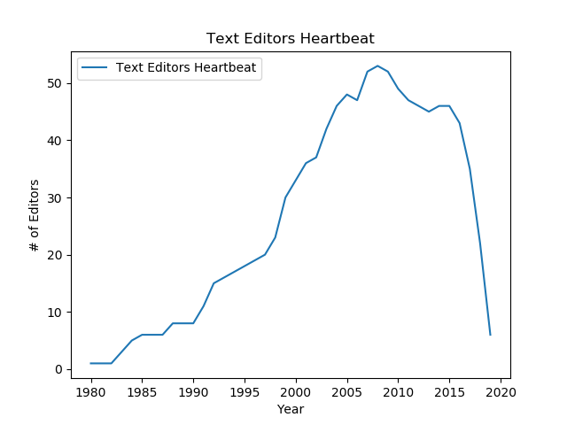

# Heartbeat

SSIS ETL project that counts up the number of notable software projects that are
in active development each year for a specified software category type.

## Text Editors Heartbeat

Editors are taken from [wikipedia](https://en.wikipedia.org/wiki/Comparison_of_text_editors)

matplotlib graph of [text editors heartbeat count](CodeHeartBeat/JobOutput/texteditors_heartbeat_count.txt)

